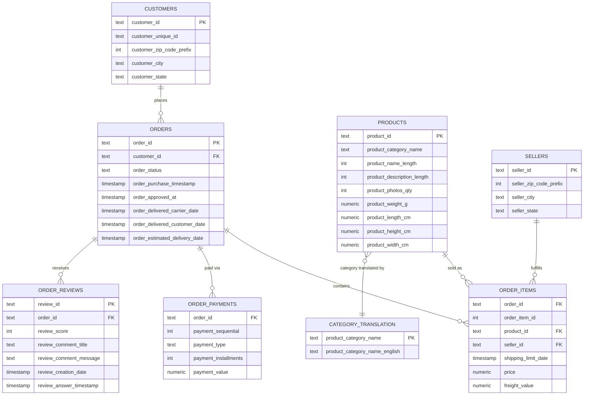

# 🛒 Olist E-Commerce Business Analytics Dashboard

An interactive Streamlit dashboard built on top of the [Olist Brazilian E-Commerce dataset](https://www.kaggle.com/datasets/olistbr/brazilian-ecommerce), backed by a Supabase (PostgreSQL) database.

This isn't just a pile of charts — every visualization on here is meant to answer a real business question, like *"which categories actually drive revenue?"* or *"does late delivery hurt review scores?"* rather than just showing numbers for the sake of it.

---

## What it does

The dashboard is split into four pages, navigated from the sidebar, each telling a different part of the business story. There's also a **date-range filter** in the sidebar that narrows every chart on every page to a specific time window — so you can, for example, look only at Q4 2017 if you want to.

### 📊 Page 1 — Overview

*The question this page answers: "How is the business doing, at a glance?"*

- **Four KPI cards** — Total Orders, Unique Customers, Total Revenue, and Average Order Value. These are the numbers you'd put in front of a manager who has 10 seconds to look at the dashboard.
- **Revenue Trend (line chart)** — monthly revenue over time. A single "total revenue" number can't tell you if the business is growing or shrinking; this chart can. It's also where seasonal spikes (like a holiday season) become obvious.
- **Monthly Order Volume (bar chart)** — order count by month, shown separately from revenue on purpose. If revenue goes up, this chart tells you *why*: is it because more people are ordering, or because each order is worth more? Those need different responses from the business.

### 💰 Page 2 — Sales & Products

*The question this page answers: "What's actually selling, and how?"*

- **Top Product Categories (horizontal bar chart)** — the 10 categories generating the most revenue. This matters more than "most units sold," because a category can sell a huge volume of cheap items and still matter less to the bottom line than a smaller category of expensive ones.
- **Top Products (table)** — the 10 individual products bringing in the most revenue, with units sold alongside. Useful for spotting a single standout product that a category-level view would hide.
- **Payment Method Analysis (donut chart)** — how customers are actually paying (credit card, boleto, voucher, debit card). This matters for checkout design — if almost nobody uses debit cards, that's not the payment flow to optimize first.

### 👥 Page 3 — Customers & Sellers

*The question this page answers: "Who's buying, who's selling, and where are they?"*

- **Customer Distribution by State (horizontal bar chart)** — where customers are concentrated geographically across Brazil. Useful for deciding where to focus marketing spend or set up regional logistics.
- **Top Customer Cities (horizontal bar chart)** — the same idea, zoomed in to city level, which is more actionable than state-level data for local decisions.
- **Top Sellers (table)** — the 10 sellers generating the most revenue, with their order counts. A marketplace's health depends on its sellers, so knowing who the strongest ones are matters for partnership decisions.
- **Seller Distribution by State (horizontal bar chart)** — how spread out the *supply* side of the marketplace is geographically, as opposed to the demand side shown earlier on this same page.

### 🚚 Page 4 — Delivery & Reviews

*The question this page answers: "Are we delivering well, and are customers happy?"*

- **Average Delivery Time (line chart)** — the average number of days between purchase and delivery, by month. A sudden jump here is usually the first sign of a logistics problem, well before it shows up in reviews.
- **Order Status (donut chart)** — the breakdown of order outcomes (delivered, shipped, canceled, etc.). A quick check on how many orders are completing successfully versus getting stuck somewhere.
- **Average Customer Review metric + Review Score Distribution (bar chart)** — the average star rating is shown, but the *distribution* is shown right next to it on purpose. A 4.0 average can hide a large group of 1-star reviews sitting behind a bigger group of 5-stars — the average alone would never reveal that.
- **Product Category vs Customer Satisfaction (horizontal bar chart)** — average review score by category. This is the payoff chart of the whole dashboard: it can reveal a category that sells *well* but satisfies customers *poorly* — a problem that revenue numbers alone would never surface.

---

## Tech stack

- **Streamlit** — the dashboard UI
- **Supabase (PostgreSQL)** — where the actual Olist data lives
- **SQLAlchemy** — connects Python to Postgres
- **Pandas** — shapes the query results
- **Plotly** — the interactive charts

---

## Database schema (ER diagram)

The Olist CSVs are relational, not flat — `orders` sits at the center, connecting customers on one side to items, payments, and reviews on the other. `order_items` is the bridge table that links `orders` to both `products` and `sellers`.



> GitHub renders Mermaid diagrams natively, so this shows up as an actual visual diagram on the repo page — no extra image file needed.

A quick way to read it: a **customer** places one or more **orders**. Each **order** can have multiple **order_items** (one row per product in the cart), gets paid for through one or more **order_payments** (e.g. split across a credit card and a voucher), and can receive **order_reviews** after delivery. Each **order_item** points to exactly one **product** and one **seller**, and each **product**'s category name gets translated into English via **category_translation**.

`geolocation` (Brazilian ZIP-code coordinates) isn't shown above since it isn't directly joined to the other tables in this dashboard's queries — it's there in the raw dataset as a lookup table if you want to extend the project with a map view later.

---

## Project structure

```
Olist_Dashboard/
│
├── app.py              # The Streamlit dashboard itself (UI + layout)
├── queries.py          # All SQL queries live here, each with a comment
│                          explaining *why* that metric matters
├── database.py          # Database connection helper
├── requirements.txt     # Python dependencies
├── .gitignore           # Keeps .env and venv/ out of version control
└── .env                 # Your own local database credentials (NOT committed)
```

---

## Running it yourself

If you clone this repo, you'll need your own Supabase project with the Olist tables loaded (`customers`, `orders`, `order_items`, `order_payments`, `order_reviews`, `products`, `sellers`, `category_translation`, `geolocation`).

**1. Clone the repo**
```bash
git clone https://github.com/sriveenahemadri-commits/olist-dashboard.git
cd olist-dashboard
```

**2. Set up a virtual environment**
```bash
python -m venv venv
venv\Scripts\activate          # Windows
source venv/bin/activate       # macOS/Linux
```

**3. Install dependencies**
```bash
pip install -r requirements.txt
```

**4. Add your own `.env` file** in the project root (this file is intentionally *not* included in the repo, since it holds real database credentials):
```
DB_HOST=your-supabase-db-host
DB_PORT=5432
DB_NAME=postgres
DB_USER=postgres
DB_PASSWORD=your-password
```

**5. Run it**
```bash
streamlit run app.py
```

It should open automatically at `http://localhost:8501`.

---

## About the dataset

This uses the **Olist Brazilian E-Commerce Public Dataset** — real (anonymized) commercial data from orders made at Olist Store between 2016–2018, covering ~100k orders across multiple Brazilian marketplaces. It includes order status, price, payment, freight performance, customer location, product attributes, and customer reviews.

---

## A note on this project

This dashboard was built as a way to practice turning a raw relational dataset into something people can actually explore and draw conclusions from — going from CSVs, to a properly normalized Postgres schema on Supabase, to SQL queries, to an interactive frontend. Nothing here is over-engineered; the goal was a clean, working pipeline that tells a clear story.
